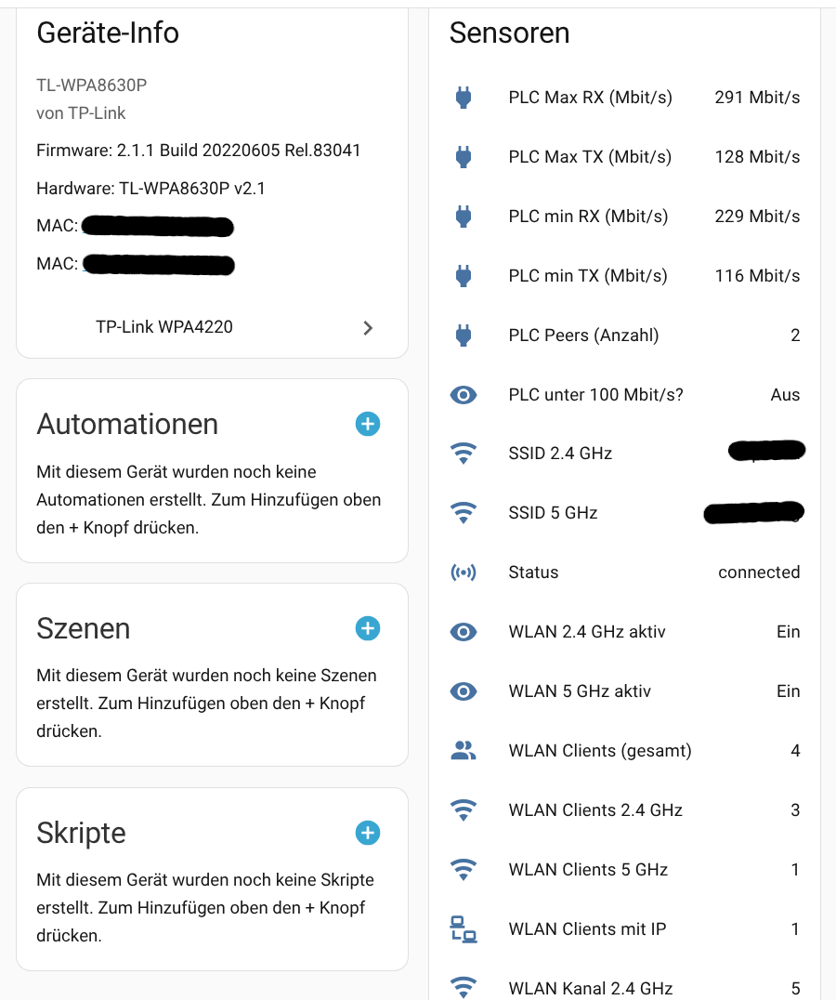

# TL‑WPA8630P
(Home Assistant Custom Integration)

Monitor your TP‑Link **WPA8630 series** powerline Wi‑Fi extender from Home Assistant: Wi‑Fi client counts, SSIDs, channels, PLC link rates, and a “degraded PLC” binary sensor. The integration logs into the device, collects status (firmware/WLAN/clients/PLC), and exposes derived sensors for quick dashboards.

<p align="center">
  
</p>

---

## Derived from

Python code adapted and derived from TL-WPA4220 (so maybe this device type is also working)<br>
see: https://github.com/3v1n0/TL-WPA4220-python

---

## Features

- **Primary status sensor** (`TP‑Link WPA4220 Status`)  
  State: `connected` or `error`. Attributes include `FirmwareInfo`, `WlanStatus`, `WifiClients`, and `PlcDeviceStatus`. Passwords from the WLAN status are **masked** with `hidden`.
- **Wi‑Fi client counters** with helpful attributes:
  - `WLAN Clients (gesamt)` – all bands  
  - `WLAN Clients 2.4 GHz`  
  - `WLAN Clients 5 GHz`  
  Each exposes `client names` and `top 12 by packets` attributes (pre‑sorted by packet count).
- **SSID & channel sensors:** `SSID 2.4 GHz`, `SSID 5 GHz`, `WLAN Kanal 2.4 GHz`, `WLAN Kanal 5 GHz`.
- **PLC link‑rate sensors:** `PLC Max RX (Mbit/s)`, `PLC Max TX (Mbit/s)`, `PLC min RX (Mbit/s)`, `PLC min TX (Mbit/s)` (unit: Mbit/s).
- **Binary sensors:** `WLAN 2.4 GHz aktiv`, `WLAN 5 GHz aktiv` (device class: connectivity) and `PLC unter 100 Mbit/s?` (device class: problem, threshold = 100 Mbit/s).
- **Device Registry integration:** model/firmware/hardware are written to the registry and Wi‑Fi MACs are registered as connections. Configuration URL points to `http://<device-ip>/`.
- **Update cadence:** by default every **2 minutes**. Derived sensors update immediately after the main sensor refreshes (via dispatcher).

---

## Installation

1. Create a folder in your Home Assistant config:  
   `custom_components/tplink_wpa4220/`
2. Copy the integration files into that folder.
3. Restart Home Assistant.

---

## Configuration

Add the integration from **Settings → Devices & Services → Add Integration** and provide:

- **IP address** of the device
- **Password** (the same one used for the device’s web UI)

The integration stores these as a config entry and will begin polling automatically. If the primary sensor shows `error`, check the `error` attribute and your credentials/IP; details are also written to Home Assistant’s log.

---

## Directory structure

```
custom_components/technicolor_cga/
├─ __init__.py
├─ config_flow.py
├─ manifest.json
├─ const.py
├─ TL_WPA4220.py
└─ sensor.p
```

## How it works (under the hood)

- The main entity logs in using a small helper (`TL_WPA4220`), fetches firmware info, PLC device status, WLAN status, and Wi‑Fi clients in parallel, then logs out. Data is shared with derived entities via a dispatcher signal so they update immediately after each refresh.
- During updates, device‑registry metadata (model, SW/HW versions, MAC connections) is refreshed for the HA device representing the extender.

---

## Notes & limitations

- Only information available from the device’s web interface is exposed; some attributes are summarized (e.g., top‑talkers by packets).
- Tested with **TL‑WPA8630P**; but the reused API code was intially designed for the **WPA4220** family (model is read from the device and written to the registry)


## Changes

- add device info, minor bugs: v0.91
- Sensors for PLC TX/RX, PLC Peers, #Wlan Clients, Wlan Channel, .... : v0.93
- adding attributes to the sensors: v0.931
<br>
> under test, if you have troubles with >0.93, fall back to 0.91 where alle the information is available under the attribute of the main sensor. This was running in my environment over a year, additional sensors were derived from the attributes via templates.
The original TLA_4220.py provides a command line interface which can be used to check if it's working in the own environment:

``` bash 
python3 TL_WPA4220.py -p <your-password> <your-ip> show
```


